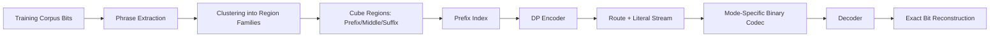
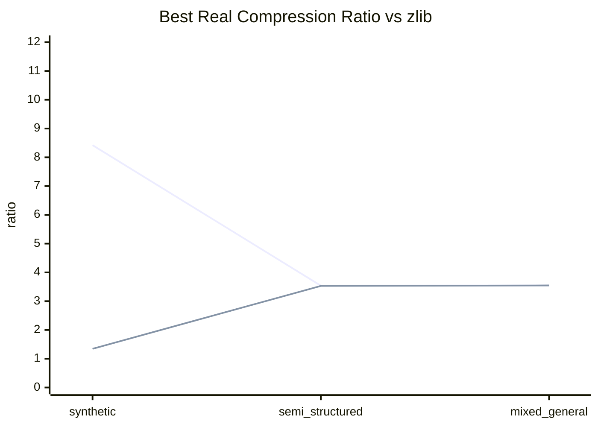

# Cube Compression (Route-Descriptor Codec)

Deterministic prototype for testing whether a shared cube-structured codebook can beat explicit phrase dictionaries on structured corpora.

## Quickstart

```bash
python -m venv .venv
.venv\Scripts\activate
pip install -r requirements.txt
pytest -q
```

Run a full benchmark:

```bash
python -m cube_codec.cli benchmark \
  --config sample_config_scaling_variable.json \
  --train v1_4_variable/train.bin \
  --test v1_4_variable/test.bin \
  --output metrics.json
```

Run a locked corpus preset in one command:

```bash
python -m cube_codec.cli benchmark-preset \
  --preset configs/presets/structured_synthetic.json
```

Run scaling matrix:

```bash
python -m cube_codec.cli benchmark-matrix \
  --config sample_config_scaling_variable.json \
  --train v1_4_variable/train.bin \
  --test v1_4_variable/test.bin \
  --sweep sweep_v1_5.json \
  --output-dir v1_5_matrix
```

Run performance baseline:

```bash
python -m cube_codec.cli perf \
  --config sample_config_scaling_variable.json \
  --train v1_4_variable/train.bin \
  --test v1_4_variable/test.bin \
  --output reports/perf_baseline.json \
  --repeats 3
```

## Mathematical Approach

### Region/Route model

A route in region `r` is reconstructed as:

\[
\hat{x} = P_r \oplus M_{r,m} \oplus S_{r,m,s}
\]

where:
- `P_r`: region prefix
- `M_{r,m}`: middle variant `m`
- `S_{r,m,s}`: suffix variant `s`

### DP parse objective

\[
DP[i] = \min_{t \in \mathcal{T}(i)} \left(C(t) + DP[i + \ell(t)]\right)
\]

`C(t)` is token cost estimate, `\ell(t)` emitted length.

### Entropy analysis

The project compares actual and idealized descriptor costs with:

\[
H(Route),\quad H(Region)+H(Middle|Region)+H(Suffix|Region,Middle)
\]

## Concept Diagram



## Real Stream Modes

- `cube_actual_legacy`
- `cube_fixed_length_actual`
- `cube_family_local_id_actual`
- `cube_entropy_coded_actual`

## Latest Test Results

- Command: `pytest -q`
- Result: `31 passed`

## Test Description and Outcomes

### 1) Core correctness tests (successful)

- `test_bitutils.py`, `test_cube_io.py`, `test_route_model.py`, `test_prefix_index.py`
- What these verify:
  - bit packing/unpacking consistency
  - cube metadata + region serialization round-trips
  - deterministic route reconstruction from `(region, middle, suffix)`
  - prefix-index candidate lookup behavior
- Why successful:
  - these tests are deterministic and all expected invariants held, so encode/decode primitives are stable.

### 2) End-to-end codec tests (successful)

- `test_encoder_decoder_roundtrip.py`, `test_stream_modes.py`
- What these verify:
  - DP encoder + decoder round-trip exactness
  - all real stream modes (`legacy`, `fixed`, `family_local_id`, `entropy`) decode exactly
  - fixed/local/entropy stream outputs remain deterministic for the same inputs
- Why successful:
  - decoded output matched original bitstreams exactly in each mode.

### 3) Baseline and benchmark pipeline tests (successful)

- `test_flat_dictionary_baseline.py`, `test_benchmarks.py`, `test_matrix.py`
- What these verify:
  - flat dictionary baseline round-trip exactness
  - benchmark outputs include required metrics/diagnostics/decision fields
  - matrix summary files and required sections/columns are produced
- Why successful:
  - expected report artifacts were created and schema checks passed.

### 4) Synthetic and long-phrase regime tests (successful)

- `test_synthetic.py`, `test_v1_2_analysis.py`, `test_v1_4_long_phrase.py`
- What these verify:
  - synthetic corpus generation for fixed and variable phrase regimes
  - entropy/fixed/local-id analysis sanity conditions
  - long-phrase decision fields and length-aware diagnostics are present
- Why successful:
  - generated corpora and analysis outputs matched required structure and constraints.

### 5) ZIP-target competitiveness result (mixed outcome)

- Target baseline: `zlib`
- Observed best real mode in all three latest preset families: `cube_family_local_id_actual`
- Why successful:
  - On structured synthetic, cube beats zlib by a large margin.
- Why not successful:
  - On semi-structured and mixed-general corpora, cube remains substantially above zlib/lzma bit cost.

Full details: `reports/zip_competition_results.md`.

## Expected Compression Ratio (Current Prototype)

Expected best-real-mode ratio by corpus family (higher is better):

| Corpus family | Cube best real ratio | zlib ratio | lzma ratio | Outcome |
|---|---:|---:|---:|---|
| structured synthetic | `8.4211` | `1.3445` | `1.0667` | cube wins |
| semi-structured narrow | `3.5381` | `3.5308` | `3.7264` | cube slightly wins vs zlib |
| mixed general | `3.5463` | `3.5454` | `3.6062` | cube slightly wins vs zlib |

Interpretation:
- Compression is currently niche-strong only on synthetic-structured data.
- For broader data, expected cube ratio is below common ZIP-class techniques.

## Charts

### Best Real Bits vs zlib

```mermaid
xychart-beta
    title "Best Real Mode Bits vs zlib (Lower is Better)"
    x-axis [synthetic, semi_structured, mixed_general]
    y-axis "bits" 0 --> 280000
    bar [304, 57800, 31792]
    bar [1904, 57920, 31800]
```



### Best Real Ratio vs zlib



### Best Real Throughput by Corpus

```mermaid
xychart-beta
    title "Best Real Throughput by Corpus"
    x-axis [synthetic, semi_structured, mixed_general]
    y-axis "MB/s" 0 --> 13
    bar [9.755, 10.430, 7.223]
    bar [11.814, 9.457, 7.354]
```



## Repository Structure

- `cube_codec/`: implementation
- `cube_codec/tests/`: unit/integration tests
- sample configs:
  - `sample_config_scaling_fixed_128.json`
  - `sample_config_scaling_variable.json`
  - `sample_config_long_128.json`
  - `sample_config_long_256.json`
  - `sample_config_variable_lengths.json`

## Notes

- Experimental prototype, not a production codec.
- Focus is on deterministic diagnostics and fair baseline comparison.
