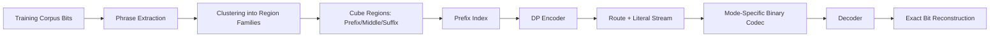
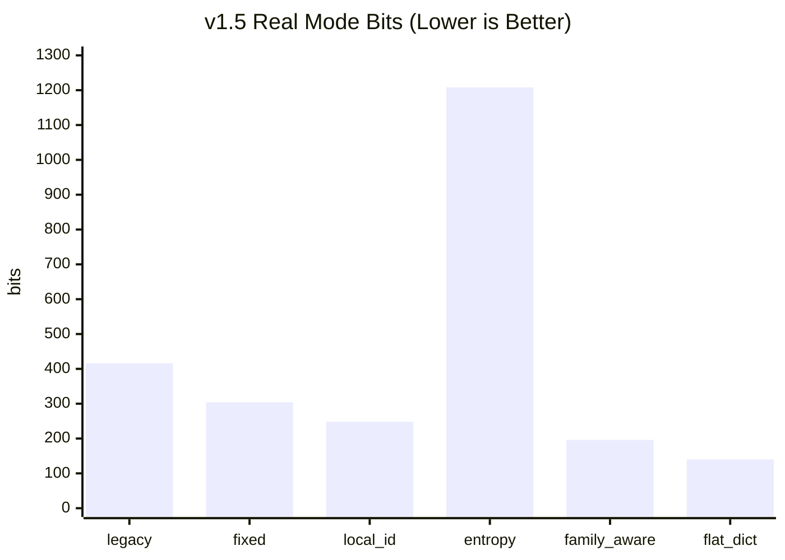
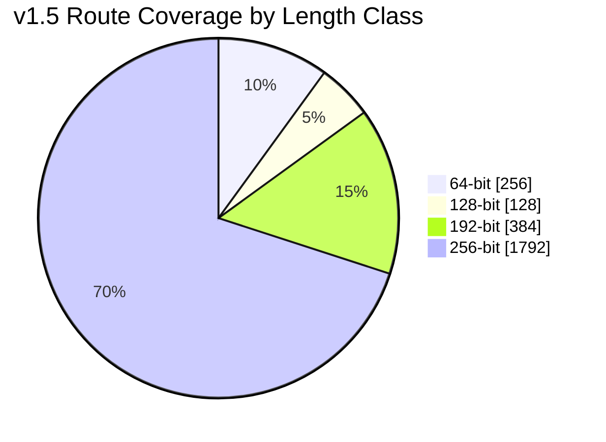
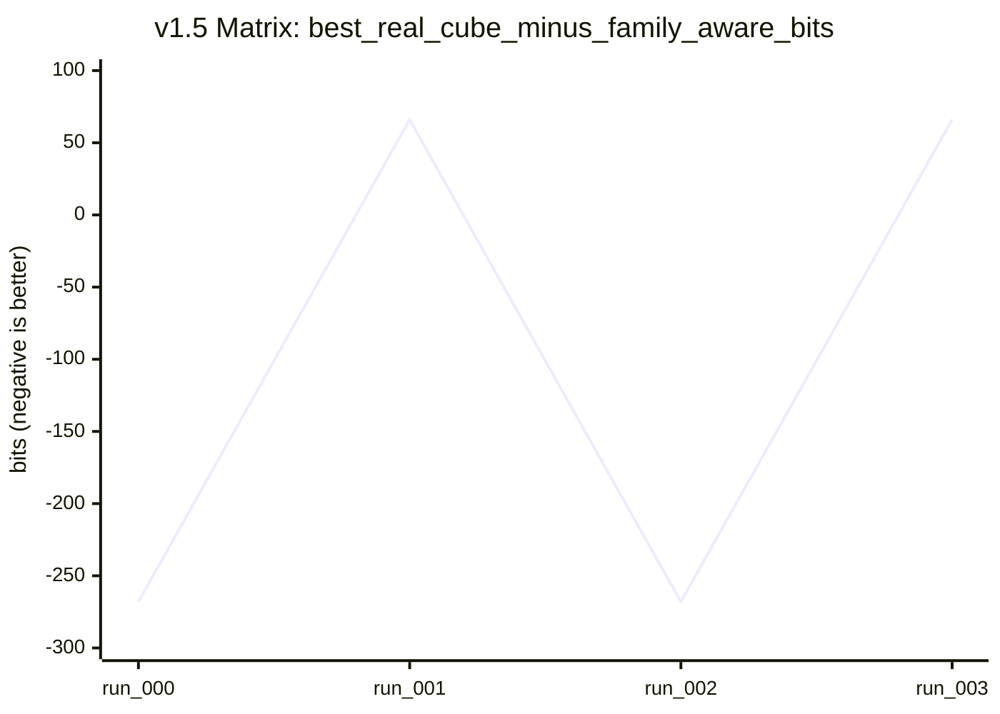

# Cube Compression (Route-Descriptor Codec)

Deterministic prototype for testing whether a shared cube-structured codebook can beat explicit phrase dictionaries on structured corpora.

## Quickstart

```bash
python -m venv .venv
.venv\Scripts\activate
pip install -r requirements.txt
pytest -q
```

Run a full benchmark:

```bash
python -m cube_codec.cli benchmark \
  --config sample_config_scaling_variable.json \
  --train v1_4_variable/train.bin \
  --test v1_4_variable/test.bin \
  --output metrics.json
```

Run scaling matrix:

```bash
python -m cube_codec.cli benchmark-matrix \
  --config sample_config_scaling_variable.json \
  --train v1_4_variable/train.bin \
  --test v1_4_variable/test.bin \
  --sweep sweep_v1_5.json \
  --output-dir v1_5_matrix
```

## Mathematical Approach

### Region/Route model

A route in region `r` is reconstructed as:

\[
\hat{x} = P_r \oplus M_{r,m} \oplus S_{r,m,s}
\]

where:
- `P_r`: region prefix
- `M_{r,m}`: middle variant `m`
- `S_{r,m,s}`: suffix variant `s`

### DP parse objective

\[
DP[i] = \min_{t \in \mathcal{T}(i)} \left(C(t) + DP[i + \ell(t)]\right)
\]

`C(t)` is token cost estimate, `\ell(t)` emitted length.

### Entropy analysis

The project compares actual and idealized descriptor costs with:

\[
H(Route),\quad H(Region)+H(Middle|Region)+H(Suffix|Region,Middle)
\]

## Concept Diagram



## Real Stream Modes

- `cube_actual_legacy`
- `cube_fixed_length_actual`
- `cube_family_local_id_actual`
- `cube_entropy_coded_actual`

## Latest Test Results

- Command: `pytest -q`
- Result: `21 passed`

## Latest v1.5 Benchmark Snapshot (from `v1_5_metrics.json`)

- `scaling_best_real_cube_mode`: `cube_family_local_id_actual`
- `scaling_best_real_cube_bits`: `248`
- `family_aware_bits`: `196`
- `scaling_average_route_emitted_bits`: `182.86`
- `scaling_cube_payload_bits`: `41152`
- `scaling_verdict`: `scaling_not_helping`

## Charts

### Real Mode Compressed Size (bits)



### Route Coverage by Length Class (bits covered)



### Scaling Matrix: Best Real Gap vs Family-Aware



## Repository Structure

- `cube_codec/`: implementation
- `cube_codec/tests/`: unit/integration tests
- sample configs:
  - `sample_config_scaling_fixed_128.json`
  - `sample_config_scaling_variable.json`
  - `sample_config_long_128.json`
  - `sample_config_long_256.json`
  - `sample_config_variable_lengths.json`

## Notes

- Experimental prototype, not a production codec.
- Focus is on deterministic diagnostics and fair baseline comparison.
