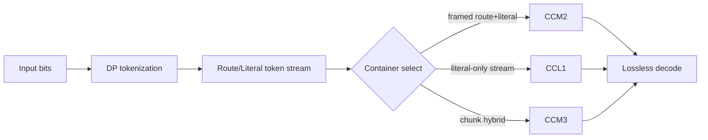
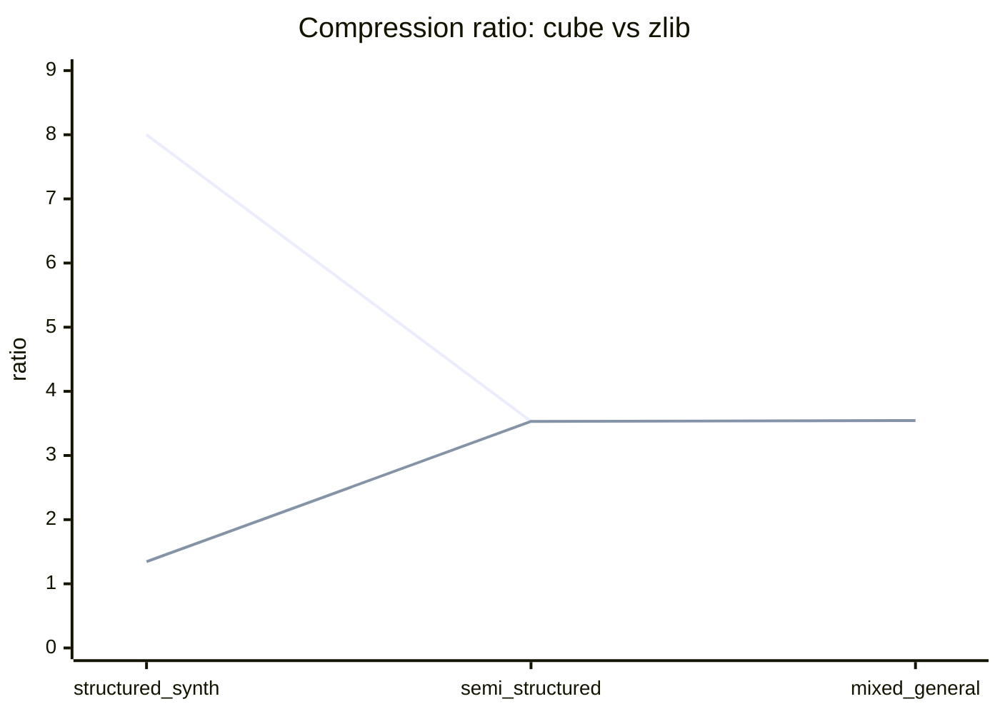

# Cube Compression Technique: Current Technical Status (2026-03-10)

## Purpose

This document captures the current implementation of the cube compression technique, its measured behavior against ZIP-class baselines (`zlib`), and recommended next steps.

## Executive Summary

- The codec is now a hybrid structured+literal system with three stream containers:
  - `CCM2` (framed route/literal stream)
  - `CCL1` (compact literal-only stream)
  - `CCM3` (chunk-level hybrid container choosing route-coded vs literal-only per chunk)
- Latest benchmark snapshot:
  - `structured_synthetic`: cube clearly beats zlib
  - `semi_structured_narrow`: cube slightly beats zlib
  - `mixed_general`: cube slightly trails zlib
- Result quality level: near-parity with zlib on real corpora, not yet a strong, stable margin.

## Core Technique

### 1) Structured route model (cube geometry)

Training builds regions with shared components:
- prefix
- middle variant set
- suffix variant set

Route token:
- `(region_id, middle_id, suffix_id, emit_length?)`

Literal token:
- explicit bit payload with bit length

Encoder uses dynamic programming over candidate tokens to minimize estimated total cost.

### 2) Real stream coding modes

Implemented real modes:
- `cube_actual_legacy`
- `cube_fixed_length_actual`
- `cube_family_local_id_actual`
- `cube_entropy_coded_actual`

Each mode can carry route/literal tokens with different descriptor codings.

### 3) Framed payload optimization (`CCM2`)

For real modes:
- token payload and literal payload are separated
- literal payload is compressed (zlib)
- token payload is optionally compressed (zlib) when it helps

This reduces overhead on literal-heavy corpora.

### 4) Compact literal-only fallback (`CCL1`)

If full stream is better represented as literal-only:
- encoder emits compact `CCL1`
- includes original mode id + literal method + exact bit length
- decoder reconstructs exact original bits losslessly

### 5) Chunk-level hybrid selection (`CCM3`)

Current `CCM3` container:
- splits stream into chunks (target bit budget)
- per chunk, chooses smaller payload:
  - route-coded chunk
  - literal-only chunk

This is the current stability/variance control mechanism for mixed content.

## Decode Safety and Determinism

Decoder behavior:
- rejects bad magic and unsupported mode ids
- rejects corrupt/truncated framed/literal/entropy payloads
- preserves exact bit-length reconstruction

Test status:
- `pytest -q` -> `31 passed`

## Measured Results vs ZIP-Class Baselines

Source: `reports/zip_competition_results.md`

| Corpus | Best cube mode | Cube bits | zlib bits | lzma bits | Cube vs zlib |
|---|---|---:|---:|---:|---:|
| structured_synthetic | cube_family_local_id_actual | 320 | 1,904 | 2,400 | -83.193% |
| semi_structured_narrow | cube_fixed_length_actual | 57,872 | 57,920 | 54,880 | -0.083% |
| mixed_general | cube_fixed_length_actual | 31,864 | 31,800 | 31,264 | +0.201% |

Interpretation:
- Very strong advantage on structured synthetic data.
- Real-data behavior is near parity with zlib, with tiny positive/negative swings.

## Throughput and Memory

Source: `reports/perf_baseline.md`

| Corpus | Best mode | Encode MB/s | Decode MB/s | Peak memory MB |
|---|---|---:|---:|---:|
| structured_synthetic | cube_family_local_id_actual | 8.360 | 14.318 | 0.49 |
| semi_structured_narrow | cube_fixed_length_actual | 6.767 | 41.839 | 38.05 |
| mixed_general | cube_fixed_length_actual | 6.371 | 34.808 | 21.07 |

## Visuals

### Pipeline overview

### Compression vs zlib (lower bits is better)

```mermaid
xychart-beta
    title "Cube vs zlib bits"
    x-axis [structured_synth, semi_structured, mixed_general]
    y-axis "bits" 0 --> 60000
    bar [320, 57872, 31864]
    bar [1904, 57920, 31800]
```

### Ratio comparison (higher is better)

### Speed profile

```mermaid
xychart-beta
    title "Best-mode throughput (MB/s)"
    x-axis [structured_synth, semi_structured, mixed_general]
    y-axis "MB/s" 0 --> 50
    bar [8.360, 6.767, 6.371]
    bar [14.318, 41.839, 34.808]
```

## Pros and Cons vs ZIP (`zlib`)

### Pros

- Better exploitation of strong repeated structure (clear synthetic advantage).
- Explicit route/literal decomposition gives rich diagnostics and controllable behavior.
- Hybrid container stack (`CCM2`/`CCL1`/`CCM3`) now adapts to structured vs literal-heavy regimes.
- Deterministic, lossless, test-backed implementation with corruption guards.

### Cons

- Real-world gains are still tiny/inconsistent relative to zlib on mixed files.
- Encoding throughput is generally lower than typical optimized ZIP tooling.
- Format complexity is higher than single-stream deflate-style formats.
- Current margin is sensitive to chunking and overhead choices.

## Future Recommendations

### Priority 1: Margin stability tuning

- Tune chunk target sizes by corpus class (e.g., 32KB, 64KB, 128KB, 256KB).
- Add smarter chunk boundary policy (content-aware boundaries, not just emitted-bit budget).
- Evaluate repeated runs and report confidence intervals, not single-run deltas.

### Priority 2: Chunk policy improvements

- Expand per-chunk decision set beyond current two choices:
  - route-coded (fixed/local/entropy variants)
  - literal-only (method variants)
- Use a stricter overhead-aware selection cost model to avoid tiny regressions.

### Priority 3: Entropy backend improvements

- Evaluate stronger entropy coding for route descriptors.
- Keep compatibility path while testing alternate backends behind feature flags.

### Priority 4: Benchmark breadth

- Add a larger personal-file benchmark pack with locked manifests.
- Track P10/P50/P90 delta vs zlib to measure stability, not only mean.

## Claim Guidance

Current defensible claim:
- Near-parity with zlib on tested real corpora, strong gains on structured synthetic data.

Not yet defensible:
- Broad “better than ZIP/zlib” claim.

Reason:
- Real-corpus advantage is still too small and not yet robust across corpus variation.
