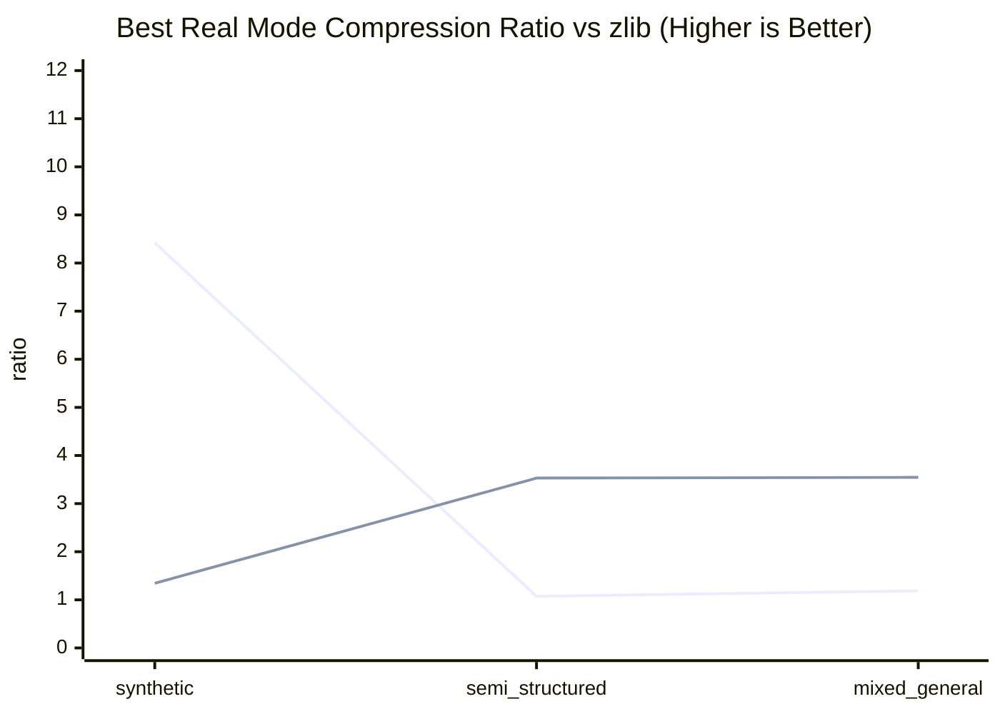

# ZIP-Class Competition Results (Phase 6 Snapshot)

Date: 2026-03-10
Target baseline: `zlib`

## Test Description

Three locked corpus families were benchmarked with identical config class (`sample_config_scaling_variable.json`) and deterministic splits:

1. `structured_synthetic` (`v1_4_variable`)
2. `semi_structured_narrow` (`corpora/phase1/semi_structured_narrow`)
3. `mixed_general` (`corpora/phase1/mixed_general`)

For each family:
- train cube on train split
- encode test split with all real modes
- decode and verify exact equality
- compare best real cube mode against zlib and lzma
- measure runtime and memory using `perf` (3 repeats)

## Correctness Outcome

All evaluated runs had exact lossless decode success (`decode_success=true`).

Why successful:
- stream codecs reject malformed mode/magic paths and preserve deterministic headers
- decode path reconstructs original bit length exactly from stored metadata

## Compression Results (Best Real Cube Mode)

| Corpus family | Original bits | Best real cube bits | zlib bits | lzma bits | Cube vs zlib |
|---|---:|---:|---:|---:|---:|
| structured_synthetic | 2,560 | 304 | 1,904 | 2,400 | **-84.0% bits** |
| semi_structured_narrow | 204,504 | 190,568 | 57,920 | 54,880 | **+229.0% bits** |
| mixed_general | 112,744 | 94,952 | 31,800 | 31,264 | **+198.6% bits** |

Interpretation:
- Success only on the synthetic niche.
- Still behind zlib/lzma on both broader non-synthetic corpora.
- Literal-side compression reduced the gap materially vs previous snapshot.

## Throughput and Memory (Best Real Cube Mode)

| Corpus family | Encode MB/s | Decode MB/s | Peak memory (MB) |
|---|---:|---:|---:|
| structured_synthetic | 12.162 | 14.312 | 0.49 |
| semi_structured_narrow | 11.990 | 11.239 | 38.05 |
| mixed_general | 10.638 | 9.534 | 21.07 |

## Charts

```mermaid
xychart-beta
    title "Best Real Mode Bits vs zlib (Lower is Better)"
    x-axis [synthetic, semi_structured, mixed_general]
    y-axis "bits" 0 --> 220000
    bar [304, 190568, 94952]
    bar [1904, 57920, 31800]
```

```mermaid
xychart-beta
    title "Best Real Mode Throughput by Corpus"
    x-axis [synthetic, semi_structured, mixed_general]
    y-axis "MB/s" 0 --> 15
    bar [12.162, 11.990, 10.638]
    bar [14.312, 11.239, 9.534]
```

## Gate C Decision (ZIP-class positioning)

Roadmap Gate C criterion:
- beat zlib by meaningful margin on at least one meaningful data niche while staying practical on speed/memory.

Current result:
- Synthetic win remains strong.
- Broader corpora still do not beat zlib/lzma.
- Therefore this snapshot still does **not** support ZIP-competitive positioning.

## Recommendation

- Keep project in research mode; do not market as ZIP competitor yet.
- Continue descriptor redesign targeting literal-heavy non-synthetic streams.
- Re-run Gate C only after another real-mode bit-cost reduction pass.